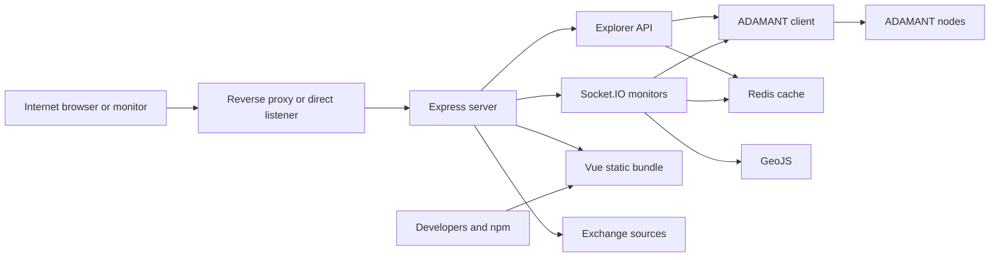

# ADAMANT Explorer Threat Model

> Security audited by [cryptofoundry](https://adamant.business#contact).
> Review date: 2026-07-19.
>

## Executive summary

ADAMANT Explorer is a public, unauthenticated, read-only blockchain application. Its main risks are availability loss from expensive public requests or overlapping polling, integrity loss when untrusted Node/Redis data is rendered or cached, browser-origin compromise through unsafe rendering, and privacy amplification from publishing and geolocating peer metadata. The current hardening narrows the HTTP surface, validates UI inputs, serializes monitor polling, adds proxy-aware rate limiting, prevents HTML interpretation of peer data, and degrades safely when Redis or external services fail. No current threat is rated critical under the stated deployment assumptions.

## Scope and assumptions

In scope:

- Runtime server and API code in `app.js`, `api/`, `sockets/`, `modules/`, `redis.js`, and `utils/`
- Vue browser code in `src/`
- Runtime configuration in `config.default.jsonc`
- Dependency and build posture in `package.json`, `package-lock.json`, and `vite.config.mjs`

Out of scope:

- ADAMANT Node and `adamant-api` internals
- Reverse-proxy, Tor, firewall, DNS, TLS certificate, Redis, and host configuration not stored in this repository
- Blockchain protocol confidentiality; normal public ledger records are public by design
- CI/release account compromise beyond repository-visible controls

Assumptions that were not confirmed during the review:

- Production is internet-facing on clear web and Tor, with no authentication or cookie session
- The common topology is local nginx over loopback to one PM2/Node process; direct Node exposure is also supported
- Redis and configuration are operator-controlled and are not reachable by public clients
- ADAMANT Node payloads, peer metadata, and external-service responses are untrusted
- Exact peer IP, hostname, and location display remains an intentional default pending #20

Open questions that would change priority:

- Multiple Explorer replicas or an external CDN/proxy would make the in-process limit aggregate above 300 requests per minute and require exact additional proxy CIDRs
- Publicly reachable Redis would raise cache integrity and credential exposure risks from medium to high
- A decision to treat peer metadata as sensitive would raise TM-007 and require backend redaction

## System model

### Primary components

- Express server: security headers, static/SPA serving, API surface guard, rate limiting, readiness, Redis response caching, and error handling (`app.js`)
- Explorer API: 12 UI routes plus operational network health, with route/query validation and response assembly (`api/routes/`, `api/lib/adamant/`)
- ADAMANT client: Node health selection, failover, REST requests, and WebSocket block events through `adamant-api` (`api/lib/adamant/requests/api.js`)
- Socket.IO monitors: Header, Activity Graph, Delegate Monitor, and Network Monitor (`sockets/`)
- Redis: optional response cache and rolling statistics persistence (`redis.js`, `cache.js`, `api/lib/adamant/handlers/statistics.js`)
- Vue SPA: same-origin API consumer and live monitor renderer (`src/`)
- External services: GeoJS peer geolocation and optional public exchange-rate sources (`api/lib/adamant/helpers/geolocation.js`, `api/lib/adamant/requests/statistics.js`, `utils/exchange.js`)
- Build/runtime supply chain: npm lockfile and Vite production build (`package-lock.json`, `vite.config.mjs`)

### Data flows and trust boundaries

- Internet browser → Express: HTTP GET/HEAD paths, query parameters, Host, forwarding headers, and Socket.IO connections; no authentication; exact API allowlist, query validation, explicit proxy trust, API rate limiting, CSP, and response headers
- Express → ADAMANT nodes: public blockchain queries and health checks over operator-configured HTTP/HTTPS through `adamant-api`; SDK failover and normalized success/error handling; successful payload validation remains incomplete
- Express ↔ Redis: cached JSON and rolling statistics over the operator network; optional username/password; failures bypass cache and keep the application serving
- Express → GeoJS: validated peer IP batches over fixed HTTPS; timeout and optional disable flag; this intentionally discloses peer IPs to a third party when enabled
- Express → exchange sources: fixed HTTPS URLs with timeouts; invalid/failed results retain previous values and overlapping refreshes are suppressed
- Express/Socket.IO → browser: public ledger, delegate, peer, and health data; Vue escaping, text-node popup construction, route/URL allowlists, and CSP constrain interpretation
- Developers/npm → production bundle: dependency code and build artifacts; lockfile, production build, lint/tests, and `npm audit` are the visible controls

#### Diagram

## Assets and security objectives

| Asset | Why it matters | Security objective (C/I/A) |
| --- | --- | --- |
| Explorer availability | Users and monitoring depend on predictable pages and health data | A |
| Blockchain and network view | Misleading balances, blocks, delegate status, or health can cause harmful operational decisions | I/A |
| Browser origin | Script execution in the Explorer origin could alter displayed data or attack visitors | I/C |
| Redis cache and statistics | Poisoned or stale cache data can misrepresent the network; outage must not stop core reads | I/A |
| Operator configuration and Redis credentials | Exposure can enable infrastructure access or data manipulation | C/I |
| Peer IP, hostname, and geolocation | Public amplification and third-party disclosure can affect node-operator privacy | C |
| Logs | Logs support recovery but must not collect secrets or user query contents | C/I/A |
| Production bundle and dependencies | Compromised build inputs execute in every visitor browser or server process | I |

## Attacker model

### Capabilities

- Send arbitrary unauthenticated HTTP methods, paths, query strings, Host headers, and high request volumes
- Open and churn Socket.IO connections
- Supply crafted public blockchain/peer fields by operating or influencing an upstream node or peer
- Cause Node, Redis, DNS, GeoJS, or exchange-service failures and timing races
- Attempt forwarding-header spoofing when connecting directly
- Exploit a compromised dependency or build input if supply-chain controls fail

### Non-capabilities

- Cannot mutate the ADAMANT ledger through Explorer, which exposes read-only routes
- Cannot choose arbitrary outbound URLs; Node and external-service destinations are operator-controlled or fixed
- Cannot set Explorer configuration, Redis contents, or trusted proxy topology without an operator/infrastructure compromise
- Cannot read message content through the reviewed UI paths; public transaction metadata is not treated as confidential message data

## Entry points and attack surfaces

| Surface | How reached | Trust boundary | Notes | Evidence (repo path / symbol) |
| --- | --- | --- | --- | --- |
| Retained HTTP API | Same-origin or direct GET/HEAD | Internet → Express | 12 UI routes plus network health | `api/lib/adamant/constants.mjs` / `SUPPORTED_API_PATHS` |
| Query parsing | API query strings | Internet → handlers/Node | Unknown, duplicate, structured, and out-of-range values are rejected | `api/routes/validation.js`; `api/lib/adamant/helpers/validation.js` |
| Rate limiter and client IP | Any `/api`-segment request | Internet/proxy → Express | Fixed 300/minute/process; 10,000 tracked identities plus one fail-closed overflow bucket; explicit proxy trust | `modules/apiRateLimiter.js`; `config.default.jsonc` / `trustedProxies` |
| Static and SPA fallback | Browser GET/HEAD | Internet → filesystem | Fixed `public/` root; API-like paths are guarded | `app.js` / `express.static`, `guardApiSurface` |
| Socket.IO namespaces | Browser connections | Internet → monitor schedulers | Four fixed namespaces; shared namespace state | `sockets/index.js` |
| ADAMANT Node calls | API and monitor work | Express → Node network | SDK health/failover; operator-controlled node list | `api/lib/adamant/requests/api.js` |
| Redis | API cache and statistics | Express → data store | Failure is non-fatal; network exposure is deployment-specific | `redis.js`; `cache.js` |
| Peer rendering | Network Monitor payloads | Node/GeoJS → browser DOM | Text nodes and allowlisted presentation classes | `src/views/NetworkMonitorView.vue`; `src/lib/peers.js` |
| Search/graph routing | Node/API result identifiers | Node → Vue Router | Named-route mapping with type and identifier validation | `src/lib/routes.js` |
| GeoJS | Peer refresh | Express → third party | Fixed HTTPS endpoint; sends validated peer IPs when enabled | `api/lib/adamant/helpers/geolocation.js` |
| Exchange rates | Background timer | Express → third party | Fixed HTTPS endpoints, timeout, no overlap | `utils/exchange.js` |
| Logs and configuration | Runtime and startup | Operator/runtime → filesystem | Query strings omitted; secrets not accepted by public routes | `utils/httpLogging.js`; `modules/configReader.js` |

## Top abuse paths

1. Resource exhaustion: an attacker sends many expensive, high-limit, or ambiguous API queries → route validation bounds work and rejects unused filters → per-IP limiting caps routine single-process abuse → distributed traffic remains an edge concern
2. Legacy route resurrection: an attacker requests a removed path with a stale Redis key → the exact API surface guard rejects it before cache lookup → response remains `404`
3. Browser-origin compromise: a malicious peer/Node supplies HTML-like hostname or labels → backend transports the data → Network Monitor creates text nodes and Vue escapes templates → CSP provides defense in depth
4. Polling storm: upstream calls slow or fail → multiple monitor ticks would overlap and amplify Node load → serialized timeout scheduling, generation checks, and bounded retry backoff prevent overlap and stale rescheduling
5. Rate-limit bypass: a direct client spoofs `X-Forwarded-For` → Express trusts only configured proxies → direct headers are ignored; local nginx supplies the real client address
6. Misleading health state: Node height changes between status, schedule, and block reads → request-time network health retries coherence checks → unresolved snapshots return bounded HTTP `503`
7. Cache integrity loss: Redis returns malformed/stale JSON or is unavailable → parse/read errors bypass the cache → block-sensitive keys include trusted height and block ID → core Node reads continue
8. Peer privacy amplification: Explorer receives peer IPs → optionally sends them to GeoJS and publishes exact metadata → operator documentation and disable control exist, while masking/redaction remains tracked in #20
9. Supply-chain compromise: a malicious dependency reaches server or browser bundles → lockfile and review checks reduce drift → a successful registry/account compromise could still execute with application privilege

## Threat model table

| Threat ID | Threat source | Prerequisites | Threat action | Impact | Impacted assets | Existing controls (evidence) | Gaps | Recommended mitigations | Detection ideas | Likelihood | Impact severity | Priority |
| --- | --- | --- | --- | --- | --- | --- | --- | --- | --- | --- | --- | --- |
| TM-001 | Remote client | Public reachability | Flood API or choose costly pagination/filter combinations | Node/Explorer exhaustion | Availability | Exact routes and query bounds (`api/routes/validation.js`); 300/minute limiter (`modules/apiRateLimiter.js`) | Per-process and per-IP only | Enforce equivalent edge limits for multi-replica/high-volume deployments | Alert on 429 rate and upstream latency | Medium | Medium | Medium |
| TM-002 | Malicious Node/peer | Attacker influences displayed fields | Deliver HTML, route, CSS-class, or identifier payloads | Browser-origin data/script manipulation | Browser origin; view integrity | Vue escaping; text-node popups (`src/views/NetworkMonitorView.vue`); route/CSS allowlists (`src/lib/routes.js`, `src/lib/peers.js`); CSP (`modules/httpSecurity.js`) | Successful upstream payload schemas are only partly validated | Complete #35 and retain CSP browser tests | CSP violation reports at the edge; frontend error monitoring without sensitive payloads | Low | High | Medium |
| TM-003 | Malicious/MITM Node | Operator selects an untrusted or plaintext remote node | Return false chain/network data that is cached and displayed | Misleading balances, blocks, delegate/health state | Data integrity | HTTPS nodes precede the retained legacy HTTP fallback; SDK health/failover (`api/lib/adamant/requests/api.js`); block-versioned cache keys (`cache.js`) | The compatibility fallback remains plaintext; no consensus cross-check | Prefer HTTPS/private links, remove the plaintext fallback when it is not required, and validate response schemas in #35 | Compare heights/hashes across independently operated nodes | Medium | High | Medium |
| TM-004 | Upstream outage | Monitor page has clients or background statistics refresh runs | Trigger retries and slow callbacks until polling overlaps | Node load, noisy logs, stale UI | Availability | Serialized timers, generation guards, retry schedule (`sockets/`) | Background consumers can still force repeated Node health refreshes and Redis reconnect logs during a total outage | Complete #36 for shared single-flight health refreshes, bounded backoff, and log deduplication; export aggregate refresh failures without peer data | Alert on repeated retry/backoff transitions | Medium | Medium | Low |
| TM-005 | Remote client | Misconfigured proxy trust | Spoof client IP and evade/collapse limits | Reduced rate-limit effectiveness | Availability | Default loopback trust and strict config validation (`modules/configValidation.js`); direct/proxy tests | External proxy/CDN topology is operator-specific | Configure exact CIDRs and overwrite forwarded headers | Compare socket peer IP with forwarded chain at proxy | Low | Medium | Low |
| TM-006 | Redis outage/compromise | Redis reachable or fails | Serve poisoned/stale values or reject cache operations | Misleading responses or higher Node load | Cache integrity; availability | Redis errors degrade to Node reads (`redis.js`, `app.js`); health bypass; block identity keys | Redis transport/access control lives outside repo | Bind privately, authenticate, persist intentionally, and monitor cache error rate | Alert on Redis reconnects, parse failures, and hit-rate shifts | Low | Medium | Low |
| TM-007 | Explorer operator/design | Peer monitor and GeoJS enabled | Publish exact peer metadata and disclose IPs to GeoJS | Privacy perception and node-operator metadata exposure | Peer metadata | Explicit documentation and `geoLocation.enabled` (`README.md`, `config.default.jsonc`) | Exact display is still the default | Resolve #20 with configurable backend redaction/generalization | Audit public socket payloads and GeoJS request counts | High | Medium | Medium |
| TM-008 | Dependency publisher/build actor | Compromised package or developer workflow | Inject code into server or browser bundle | Broad code execution/data manipulation | Bundle; server; browser origin | Lockfile, production build, lint/tests, clean `npm audit` | Audit cannot detect all malicious releases; major upgrades pending | Review and stage #34; protect release accounts and verify artifacts | Dependabot/SCA alerts and reproducible bundle review | Low | High | Medium |
| TM-009 | GeoJS/exchange outage | Optional integration enabled | Timeout, fail, or return malformed data | Missing enrichment/rates | Availability; display integrity | Fixed URLs, timeouts, normalization, last-known rates, no-overlap refresh (`utils/exchange.js`, geolocation helpers) | No service-level metrics | Keep optional and expose aggregate degraded status only if operationally needed | Alert on sustained source failures | Medium | Low | Low |

## Criticality calibration

- Critical: unauthenticated server-side code execution; compromise of operator secrets; a browser-origin compromise reliably affecting all visitors
- High: systematic falsification of balances/blocks/health; remotely exploitable persistent XSS; public Redis compromise that controls cached responses
- Medium: bounded API or monitor denial of service; targeted Node-data integrity manipulation; unnecessary peer metadata amplification; rate-limit bypass under a specific proxy misconfiguration
- Low: short-lived loss of optional rates/geolocation; easily recovered cache outage; noisy retries that preserve the last coherent view

Examples reflect the current read-only design: there is no account login, private-key custody, transaction submission, or privileged user state in Explorer.

## Focus paths for security review

| Path | Why it matters | Related Threat IDs |
| --- | --- | --- |
| `app.js` | Middleware order defines headers, surface guard, limiter, cache, readiness, fallback, and failure behavior | TM-001, TM-005, TM-006 |
| `api/lib/adamant/helpers/validation.js` | Central public-input type, range, and identifier boundary | TM-001 |
| `api/lib/adamant/constants.mjs` and `api/lib/adamant/helpers/http.js` | One shared supported-path contract prevents frontend/backend drift and legacy route revival | TM-001, TM-006 |
| `api/lib/adamant/requests/` | Sole Node trust boundary and remaining response-schema gap | TM-002, TM-003 |
| `api/lib/adamant/helpers/networkHealth.js` | Coherence logic drives monitoring decisions | TM-003, TM-004 |
| `sockets/` | Shared lifecycle, retry, timer, and broadcast state | TM-004 |
| `cache.js` | Cache identity and volatility policy affect data correctness | TM-003, TM-006 |
| `modules/apiRateLimiter.js` | Abuse control depends on IP and window semantics | TM-001, TM-005 |
| `modules/httpSecurity.js` | CSP must preserve same-origin sockets without Host injection | TM-002 |
| `src/views/NetworkMonitorView.vue` | Renders the most privacy-sensitive and Node-controlled fields | TM-002, TM-007 |
| `src/lib/routes.js` | Converts untrusted search/graph fields into navigation | TM-002 |
| `api/lib/adamant/helpers/geolocation.js` | Validates data sent to and received from the peer-IP service | TM-007, TM-009 |
| `utils/exchange.js` | Optional external polling must not overlap or replace good data with failures | TM-004, TM-009 |
| `modules/configReader.js` | Operator-controlled topology, credentials, nodes, and privacy choices enter here | TM-003, TM-005, TM-007 |
| `package-lock.json` | Pins the code executed in server and browser builds | TM-008 |

### Quality check

- Covered all discovered HTTP, Socket.IO, Node, Redis, external-service, configuration, logging, and build entry points
- Represented every runtime trust boundary in at least one threat
- Kept runtime risks separate from development/build supply-chain risks
- Marked unconfirmed deployment and privacy assumptions explicitly
- Distinguished public blockchain data from privacy-sensitive amplification
- Linked residual work to #20, #34, #35, and #36
